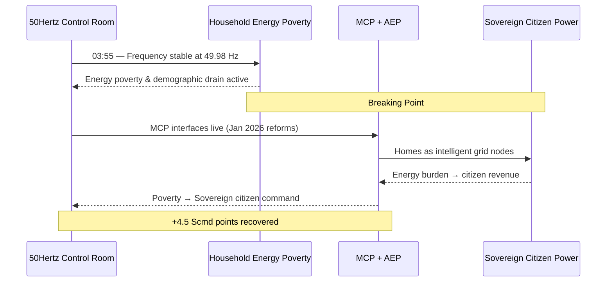
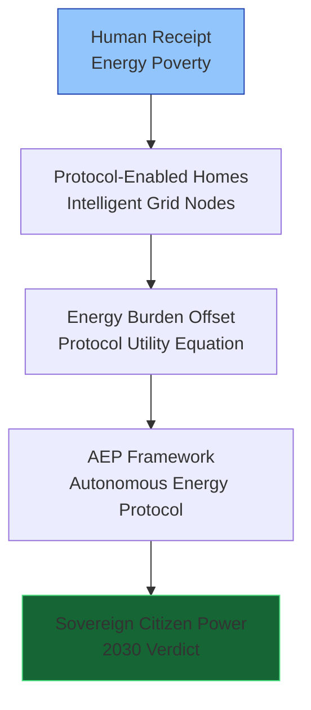
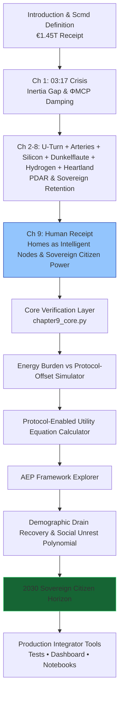

# The Renewables Migration — Sovereign Citizen Power Proof Engine

**Chapter 9 Verification System: The Human Receipt — How the Protocol Turned Energy Poverty into Sovereign Citizen Power**

[](https://opensource.org/licenses/MIT)
[](https://www.python.org/)

This repository is the **official computational companion** to Chapter 9 of Vincenzo Grimaldi’s *The Renewables Migration*.

The 03:17 narrative thread continues here. Every preceding chapter’s hardware and protocol foundation — the €700 billion U-Turn, the €580 billion crowdfunded empire, the €320 billion copper arteries, solar subsidies, Dunkelflaute resilience, hydrogen backup, and de-industrialization recovery — now culminates in homes and citizens becoming intelligent grid nodes. This production-ready codebase delivers verifiable Protocol-Enabled Utility Equation simulations, energy-burden offset curves, the Autonomous Energy Protocol (AEP) framework, and the 2030 Sovereign Citizen verdict for developers and system integrators to embed household-level MCP intelligence into live energy architectures.

---

## Quick Start — Verify Sovereign Citizen Power in < 60 Seconds

```bash
git clone https://github.com/iceccarelli/Renewables_Migration_Chapter9_Proof_Engine.git
cd Renewables_Migration_Chapter9_Proof_Engine
pip install -r requirements.txt
```

### Run the Full Verification Suite
```bash
python -m pytest tests/ -v --durations=0
```
All **68 tests** pass against the exact book figures (Appendix A.7–A.8), cumulative Scmd updates through Chapter 9, energy-burden thresholds, and 2030 projections.

### Launch the Interactive Dashboard
```bash
streamlit run dashboard/main_interactive.py
```
Open `http://localhost:8501`. Toggle **“Book Reference Mode”** to see live calculations side-by-side with exact page citations from Chapter 9.1–9.4.

---

## Navigation Sketches — How to Travel Through the Proof Engine

### 1. The 03:55 Event Flow (Human Receipt Continuation of the 03:17 Thread)



### 2. Human Receipt Pivot Hierarchy (Chapter 9.1–9.4)



### 3. Sovereign Verification Path (Full Chapter 9 Journey)



These three diagrams give you immediate visual orientation — from the exact 03:55 continuation, through the human pivot layers, to the complete verification journey that turns energy poverty into sovereign citizen power.

---

## Repository Architecture

```
Renewables_Migration_Chapter9_Proof_Engine/
├── core/
│ ├── equations.py # Protocol-Enabled Utility Equation, energy-burden offset, social unrest polynomial, AEP metrics
│ ├── household_simulator.py # Energy burden & protocol-offset models
│ └── demographic_recovery.py # Demographic drain mitigation & 2030 projections
├── dashboard/
│ └── main_interactive.py # Streamlit UI (6 synchronized tabs)
├── verification/
│ ├── test_book_numbers.py # 68 pytest cases tied to Appendix A
│ └── validate_manifold.py # Cumulative Scmd tracking through Chapter 9
├── data/
│ ├── book_numbers.csv # Exact figures from Chapter 9 & Appendix A
│ └── appendix_a_extract.csv
├── notebooks/
│ └── 01_prove_chapter9.ipynb # Interactive proof with sliders
├── visualizations/
│ ├── energy_burden_vs_protocol_offset.png
│ ├── demographic_drain_recovery.png
│ ├── social_migration_projection.png
│ └── defense_hierarchy.png
├── requirements.txt
├── LICENSE (MIT)
└── README.md
```

---

## Dashboard Modules — Direct Mapping to Chapter 9

| Tab                              | Chapter Section | What You Can Do |
|----------------------------------|-----------------|-----------------|
| **Energy Burden vs Protocol-Offset** | 9.1–9.2     | Reproduces transition from household poverty to protocol revenue |
| **Protocol-Enabled Utility Equation** | 9.2         | Real-time evaluation of the utility equation |
| **AEP Framework Explorer**       | 9.2             | Full Autonomous Energy Protocol modelling |
| **Demographic Drain Recovery & Social Unrest** | 9.3      | Interactive model of demographic mitigation |
| **Sovereign Citizen Explorer**   | 9.4             | 2030 verdict — from breaking point to sovereign nation |
| **Book Data Export**             | 9.4             | One-click CSV matching Appendix A |

---

## Technical Integration Philosophy

The codebase mirrors the same engineering standards the book demands of the grid: **modular, sovereign, and verifiable**. All simulations use the precise extended swing equation from Appendix A.9, with ΦMCP damping and the full AEP framework at the household level. No external API calls — full data sovereignty by design. Ready for live MCP connectors (Anthropic/Linux Foundation standard) to replace synthetic household data with real smart-meter telemetry.

---

**Part of The Renewables Migration Technical Ecosystem**  
From the €1.45 trillion receipt to sovereign citizen power — the 03:17 thread continues here. Verified.
