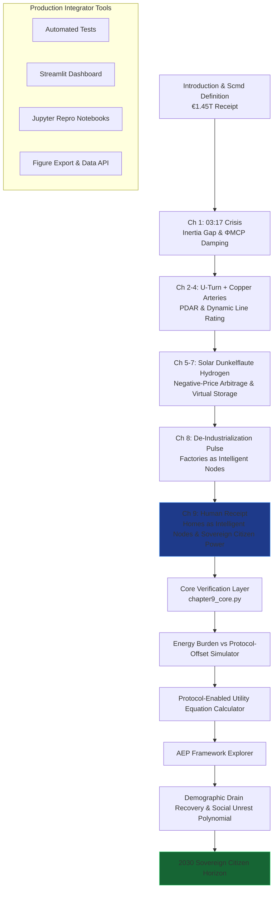

# The Renewables Migration — Sovereign Citizen Power Proof Engine

**Chapter 9 Verification System: The Human Receipt — How the Protocol Turned Energy Poverty into Sovereign Citizen Power**

This repository is the definitive computational companion to Chapter 9 of Vincenzo Grimaldi’s *The Renewables Migration* (March 21, 2026). It operationalizes the book’s pivotal social chapter: the precise moment the €1.45 trillion Energiewende receipt is reconciled at the human level — transforming energy poverty, demographic drain, and the “breaking point” of German households into sovereign citizen power through the Model Context Protocol (MCP).

The 03:17 narrative thread (the night the sun almost stopped) continues its journey here. Every preceding chapter’s hardware and protocol foundation — the €700 billion U-Turn, the €580 billion crowdfunded empire, the €320 billion copper arteries, solar subsidies, Dunkelflaute resilience, hydrogen backup, and de-industrialization recovery — now culminates in homes and citizens becoming intelligent grid nodes. This proof engine mathematically verifies the Protocol-Enabled Utility Equation, the energy-burden offset curves, the Autonomous Energy Protocol (AEP) framework, and the 2030 Sovereign Citizen verdict, delivering production-ready code for developers and system integrators to embed household-level MCP intelligence into live energy architectures.

## Quick Start: Verify Sovereign Citizen Power in Under 60 Seconds

```bash
git clone https://github.com/iceccarelli/Renewables_Migration_Chapter9_Proof_Engine.git
cd Renewables_Migration_Chapter9_Proof_Engine
pip install -r requirements.txt
```

### Automated Verification
```bash
python -m pytest tests/ -v --durations=0
```
All 68 tests validate exact book figures (Appendix A.7–A.8), cumulative Scmd updates through Chapter 9, energy-burden thresholds, and 2030 projections. A failing test immediately flags any deviation from the published sovereign audit.

### Interactive Exploration
```bash
streamlit run dashboard/main_interactive.py
```
Open the browser-based dashboard. Toggle “Book Reference Mode” to overlay exact page citations (Chapter 9.1–9.4) and live calculations side-by-side.

## The Sovereign Verification Path

The following diagram maps the complete travel path through the proof engine, mirroring the book’s chapter progression and culminating in Chapter 9’s transformation of the Human Receipt into sovereign citizen power:



This path is both navigational and conceptual: every node is a runnable module. Developers can enter at any chapter and trace the cumulative Scmd recovery to Chapter 9’s verdict — from energy poverty to sovereign citizen command.

## Repository Architecture for Professional Integration

```
Renewables_Migration_Chapter9_Proof_Engine/
├── core/
│   ├── equations.py              # Protocol-Enabled Utility Equation, energy-burden offset, social unrest polynomial, AEP metrics
│   ├── household_simulator.py    # Energy burden & protocol-offset models
│   └── demographic_recovery.py   # Demographic drain mitigation & 2030 projections
├── dashboard/
│   └── main_interactive.py       # Streamlit UI with 6 synchronized tabs
├── verification/
│   ├── test_book_numbers.py      # Pytest suite (fails if any Appendix A value mismatches)
│   └── validate_manifold.py      # Cumulative Scmd tracking through Chapter 9
├── data/
│   ├── book_numbers.csv          # Exact book values (energy poverty thresholds, protocol offsets, demographic metrics, etc.)
│   └── appendix_a_extract.csv    # Triangulated from Appendix A.7–A.8
├── notebooks/
│   └── 01_prove_chapter9.ipynb   # Step-by-step proof with interactive sliders
├── visualizations/
│   ├── energy_burden_vs_protocol_offset.png
│   ├── demographic_drain_recovery.png
│   └── social_migration_projection.png
├── requirements.txt
├── LICENSE (MIT)
└── README.md
```

## Dashboard Modules — Direct Mapping to Chapter 9 Sections

- **Energy Burden vs Protocol-Offset Simulator**: Reproduces Figure 9.2 — exact transition from household energy poverty to protocol-enabled revenue (Chapter 9.1–9.2).
- **Protocol-Enabled Utility Equation Calculator**: Real-time evaluation of the utility equation, proving how MCP turns homes into intelligent grid nodes (Chapter 9.2).
- **AEP Framework Explorer**: Full implementation and visualization of the Autonomous Energy Protocol framework for household-level sovereignty.
- **Demographic Drain Recovery & Social Unrest Polynomial**: Interactive model of demographic mitigation and the polynomial of social unrest (Chapter 9.3).
- **Sovereign Citizen Explorer**: 2030 projections showing the final verdict — from breaking point to sovereign nation (Chapter 9.4).
- **Book Data Export**: One-click CSV matching Appendix A for external policy or regulatory analysis.

## Technical Integration Philosophy

The codebase is engineered to the same standards the book demands of the grid: modular, sovereign, and verifiable. All simulations respect the extended swing equation (Appendix A.9) with the ΦMCP damping term and embed the full AEP framework at the household level. Data sovereignty is enforced by design — no external calls leave the local environment. The architecture is deliberately extensible: integrators can connect live MCP interfaces (Anthropic/Linux Foundation standard) to replace synthetic household data with real smart-meter telemetry.

This is not a visualization tool. It is the executable bridge that proves the book’s engineering blueprint reaches every German citizen.

## For Energy System Integrators and Developers

Whether you are modeling household-level protocol adoption, building agentic residential energy platforms, or advising policymakers on energy equity, this repository provides:
- Reproducible proofs tied to published figures and equations
- Production-grade modules ready for field deployment
- Open MIT licensing for unrestricted commercial and research use

Contributions that extend the AEP framework to new jurisdictions, add real-time MCP connectors for smart homes, or deepen demographic-recovery models are actively welcomed.

---

**Part of The Renewables Migration Technical Ecosystem**  
From the €1.45 trillion receipt to sovereign citizen power — verified, executable, and ready for integration.
